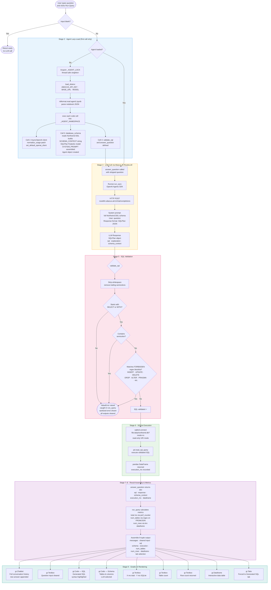

# Semantic Query Agent — Process & Data Flow

---

## Stage Summary

| # | Stage | Owner | Key Output |
|---|---|---|---|
| 1 | Button click / Enter key fires `run_query()` | `app.py` | Function call initiated |
| 2 | Agent lazy-load — notebook exec'd once | `app.py` + `agent1.ipynb` | `_AGENT_NAMESPACE` populated, `Agent` object ready |
| 3 | `answer_question(question)` called | `agent1.ipynb` Cell 4 | Async agent runner invoked |
| 4 | LLM call → RouteLLM API | `agent1.ipynb` Cell 4 | `SQLPlan` (sql, explanation, schema_context) |
| 5 | SQL validation — blocklist + structure checks | `agent1.ipynb` Cell 4 | Validated SQL string or `ValueError` |
| 6 | SQLite execution in read-only mode | `agent1.ipynb` Cell 4 | `pandas.DataFrame` + `execution_ms` |
| 7 | Result dict assembled | `agent1.ipynb` Cell 4 | Dict with all result fields |
| 8 | Metrics calculated, 9-tuple built | `app.py` | Gradio output tuple |
| 9 | UI components updated | Gradio / `app.py` | Chatbot, SQL tab, dataframe, metrics all rendered |

## Key Design Notes

- **No conversation history to LLM** — chat history renders in the Gradio Chatbot widget but every LLM call is stateless (question only).
- **Schema is static** — Northwind DDL is read once at startup and injected into every system prompt; no vector search or dynamic retrieval.
- **Two-tier SQL safety** — LLM instructed via prompt (Tier 1) + hard regex blocklist and read-only SQLite URI (Tier 2).
- **Thread safety** — `_AGENT_LOCK` ensures the notebook is exec'd exactly once even under concurrent Gradio requests.
- **Error boundary** — any exception in stages 3–7 is caught; a sanitized message appears in chat and all other outputs are reset.
